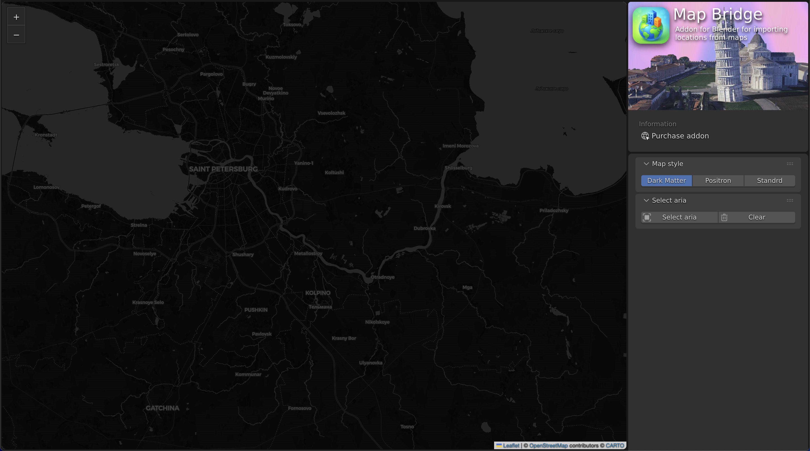
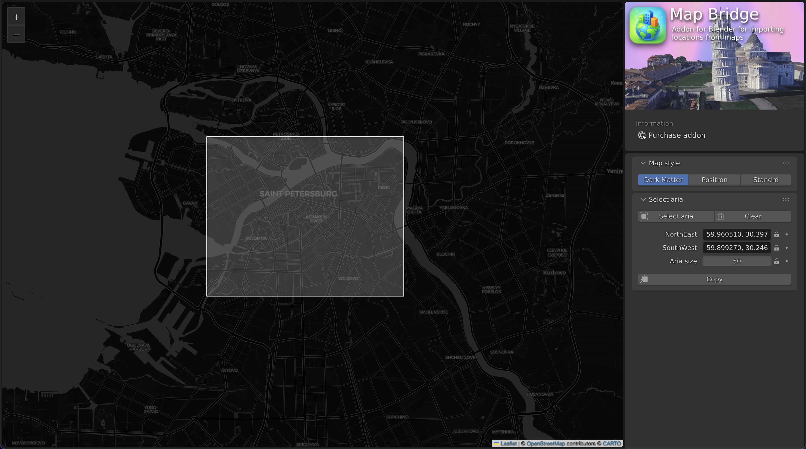

  

<h1 align="center">Map Bridge</h1>

> 🌐 Web interface for aria selection for Map Bridge Blender addon

Вот готовое описание для твоего README на английском с добавлением скриншотов.

---

# Map Bridge Web App

A single-page web application for selecting an importable area from the map.
Once the area is selected, you can copy its coordinates and paste them into the **Map Bridge** Blender add-on to import the chosen location.

## Features

- Select a custom area on the map and copy its **bbox** coordinates.
- Switch between different map styles.
- Simple, intuitive interface.

## How to use

1. Open the **"Select aria"** tab in the right panel.
2. Click the **"Select aria"** button.
3. On the map, hold the mouse button and drag to select the desired area.
4. After selection, copy the **bbox** coordinates by clicking the **"Copy"** button.
5. Paste the copied coordinates into the **Map Bridge** Blender add-on.

## Map styles

You can switch between available map styles (e.g., Dark Matter, Positron, Standard) to better suit your workflow.

## 🚀 Quick start

You have to install [NodeJS](https://nodejs.org/en/download) before start

- `git clone https://github.com/KIWIbird717/Map-Bridge-Web-Interface.git`
- `cd Map-Bridge-Web-Interface`
- `npm install`
- `npm run preview`

---

## Screenshots

### Main view

### Area selection

